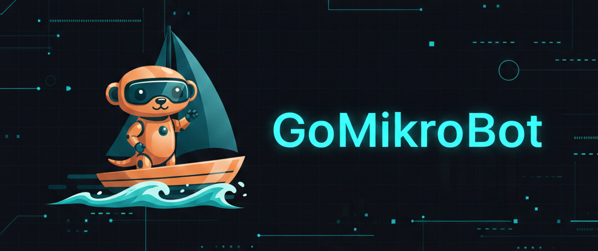

# GoMikroBot

A Go-based bot that aims to become a self-controlled personal assistant for day-to-day digital tasks.



## Focus

- Behavior-first migration from the original Python system.
- Reliability, performance, and clear architecture.
- Documented decisions and parity testing during the rewrite.

## Status

This repository is in active migration to Go. See `AGENTS.md` for the agent workflow, and the folders below for the current source of truth.

## Source of Truth

- `PH/` prompt history (immutable)
- `requirements/` what must be preserved or changed
- `arch/` Go architecture and mappings
- `tasks/` migration steps and acceptance criteria
- `bug-tracker/` investigations and parity issues
- `docs/` developer explanations

## Quick Start

Build and run (details may change as migration progresses):

```bash
go build ./...
```

## Project Structure

```
requirements/
arch/
tasks/
bug-tracker/
docs/
```

## Releases

- Local release: use `make release` (or `make release-minor` / `make release-patch`) in `gomikrobot/`.
- GitHub release: push a tag `vX.Y.Z` to trigger the build workflow and attach artifacts.
- See `docs/release.md` for details.

## License

MIT
