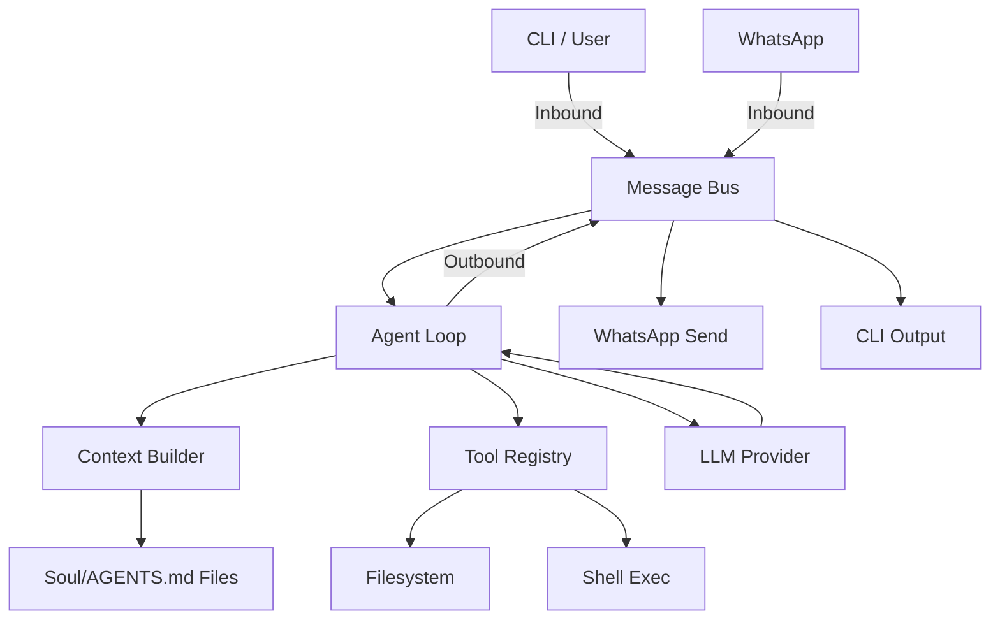

# 🏗️ GoMikroBot Architecture

GoMikroBot is a high-performance, secure, and modular AI agent framework written in **Go**. The "smart beast" is structured into several core layers that ensure separation of concerns and reliable operation.

## 🧱 Component Overview

### 1. Core Agent Loop (`internal/agent`)
The heart of the system. It manages the state machine of a conversation:
- **Loop**: Orchestrates the interaction between the LLM and the tools.
- **Context Builder**: The "Soul Loader". It dynamically constructs the system prompt by aggregating files from the workspace (identity, soul, personality).

### 2. Message Bus (`internal/bus`)
An asynchronous event system that handles communication between different parts of the bot:
- **Inbound Channel**: Messages coming from the outside world (WhatsApp, CLI).
- **Outbound Channel**: Messages produced by the agent to be delivered to channels.

### 3. Channels (`internal/channels`)
The interface to the outside world.
- **Native WhatsApp**: Powered by `whatsmeow`. A direct Go implementation that eliminates the need for external bridges (like Node.js).
- **CLI**: Direct interaction via the terminal.

### 4. Tool Framework (`internal/tools`)
The agent's "hands". A registry of capabilities:
- **Filesystem**: Read/Write/Edit files with path safety.
- **Shell**: Execute commands with recursive timeout and pattern-based security.
- **Web**: (Planned) Search and fetch capabilities.

### 5. Session Management (`internal/session`)
Handles long-term memory and conversation history:
- Persists data in **JSONL** format for speed and robustness.
- Manages unique session IDs across different channels.

### 6. Provider Layer (`internal/provider`)
Abstractions for LLMs.
- Currently defaults to **OpenAI/OpenRouter** optimized for `gpt-4o` and `claude-3.5-sonnet`.

---

## 🛰️ System Layout

## 🧠 The Soul (Dynamic Context)
Unlike static agents, GoMikroBot builds its personality at runtime. It scans the `workspace/` directory for:
- `AGENTS.md`: Core operating instructions.
- `SOUL.md`: Personality traits and goals.
- `USER.md`: Information about the owner.
- `memory/MEMORY.md`: Long-term persistent facts.
