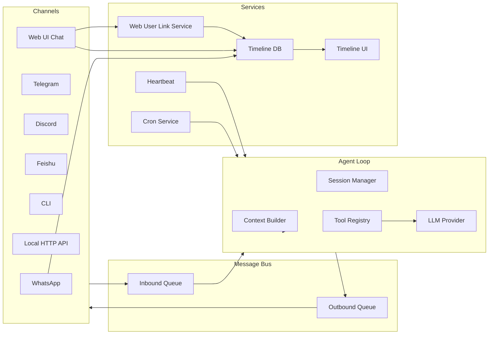
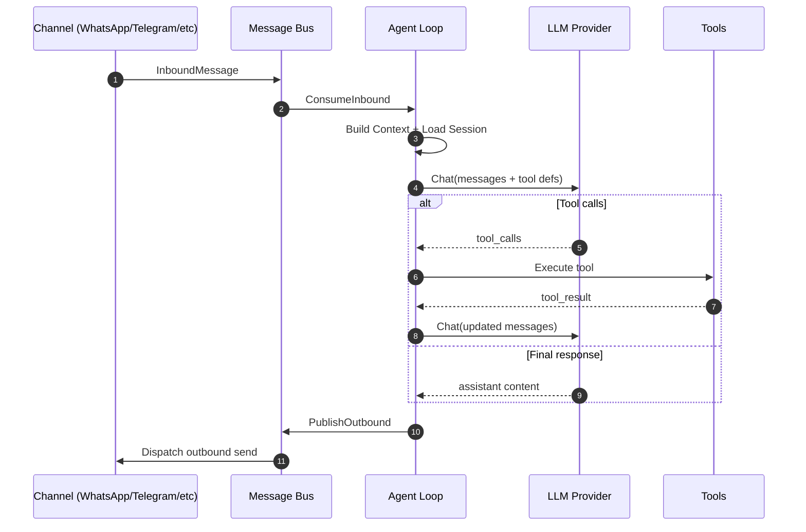
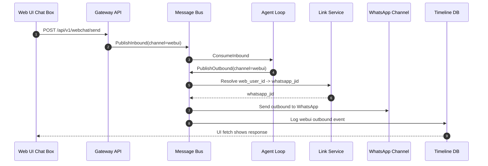

# Bot Structure and Dynamics (Python Reference vs Go Implementation)

This document summarizes how the bot works, what it can deal with, and the key differences between the Python reference and the Go native implementation.

---

## Structural Chart (Components and Responsibilities)

**What it can deal with (capability map):**
- Inbound chat messages from WhatsApp, Telegram, Discord, Feishu, CLI, and local HTTP API.
- Outbound replies to the same channels.
- Web UI chat messages routed into the agent loop and delivered to linked WhatsApp users.
- Simple Web-User onboarding and WhatsApp link management (no OAuth).
- Tool-driven actions: filesystem read/write/edit/list, shell exec, web search/fetch, cron scheduling, subagent spawn, message tool.
- Session history and memory context per channel/chat.
- Timeline logging and media capture for WhatsApp (Go native).
- Cron jobs and heartbeat-triggered tasks (Python reference).

---

## Dynamic Chart (Message Flow)

---

## Python Reference (Key Components)

**Core agent loop**
- `nanobot/agent/loop.py`
- Handles inbound messages, builds context, runs LLM tool loop, writes session history, publishes outbound responses.

**Message bus (async)**
- `nanobot/bus/queue.py`
- Async queues for inbound/outbound, with an outbound dispatcher.

**Channels manager**
- `nanobot/channels/manager.py`
- Starts channels and dispatches outbound messages to channel-specific `send()`.

**Channels (WhatsApp bridge + others)**
- `nanobot/channels/whatsapp.py`
- `nanobot/channels/telegram.py`
- `nanobot/channels/discord.py`
- `nanobot/channels/feishu.py`

**Gateway orchestration**
- `nanobot/cli/commands.py` (`gateway` command)
- Wires bus, provider, agent loop, cron, heartbeat, and channel manager.

---

## Go Native Implementation (Key Components)

**Core agent loop**
- `gomikrobot/internal/agent/loop.go`
- Equivalent tool-call loop using provider interface, sessions, and context builder.

**Message bus (goroutines)**
- `gomikrobot/internal/bus/bus.go`
- Inbound/outbound channels with subscription-based outbound dispatch.

**WhatsApp native channel**
- `gomikrobot/internal/channels/whatsapp.go`
- Direct WhatsApp integration with `whatsmeow`, media download, transcript, timeline logging.

**Gateway orchestration**
- `gomikrobot/cmd/gomikrobot/cmd/gateway.go`
- Wires bus, provider, agent loop, timeline DB, WhatsApp channel, dashboard API/UI.

**Timeline service**
- `gomikrobot/internal/timeline/service.go`
- SQLite-based timeline, settings storage (including silent mode), timeline API consumption by dashboard.

---

## Differences: Python Reference vs Go Native

**Architecture and runtime model**
- Python is `asyncio`-driven with async queues and async channel dispatchers.
- Go uses goroutines and channels, with a subscription-based outbound dispatcher.

**WhatsApp integration**
- Python uses a Node.js bridge with WebSocket (`bridge/` + `nanobot/channels/whatsapp.py`).
- Go uses a native WhatsApp client (`whatsmeow`) in `gomikrobot/internal/channels/whatsapp.go`.

**Timeline and dashboard**
- Go includes a built-in timeline DB and UI serving (dashboard + `/api/v1/timeline`).
- Python reference does not include timeline DB/UI in the core flow.

**Silent mode control**
- Go includes persistent `silent_mode` in timeline settings, default-on, enforced in WhatsApp channel.
- Python reference does not implement silent mode in the WhatsApp bridge path.

**Tool coverage**
- Python registers a broader set of default tools (exec, web search/fetch, message, spawn, cron).
- Go currently registers core file/exec tools; broader tool set is pending or partial.

**Cron + heartbeat**
- Python gateway includes cron scheduling and heartbeat service by default.
- Go gateway currently does not wire cron or heartbeat services.

**Provider implementation**
- Python uses LiteLLM to support many providers in one interface.
- Go uses a custom provider interface with OpenAI-compatible implementations.

---

## Notes on “What It Can Deal With” (Current Go Native)

- Inbound WhatsApp messages (text, image, audio, documents) with media download and optional transcription.
- Outbound WhatsApp replies (subject to silent mode).
- Web UI chat messages routed through agent loop and mirrored in timeline UI.
- Web-User ↔ WhatsApp linking for outbound delivery to personal WhatsApp.
- Local HTTP API endpoint for simple chat requests.
- Timeline logging and UI for WhatsApp events.
- File and shell tools for agent actions.

For more detail, see:
- `gomikrobot/internal/channels/whatsapp.go`
- `gomikrobot/internal/agent/loop.go`
- `gomikrobot/internal/bus/bus.go`
- `gomikrobot/cmd/gomikrobot/cmd/gateway.go`

---

## Web UI Chat Flow

---

## Timeline Storage Model (Go Native)

**Primary store:** SQLite (`~/.gomikrobot/timeline.db`)

**Core table:** `timeline`
- `event_id`: Unique event identifier (channel-specific or generated).
- `timestamp`: Event time.
- `sender_id`: External sender or internal marker (e.g., `webui:alice`, `AGENT`).
- `event_type`: `TEXT`, `SYSTEM`, or media types.
- `content_text`: Text or summary.
- `classification`: Routing/diagnostic tag (e.g., `WEBUI_OUTBOUND status=sent`).
- `authorized`: Boolean allowlist indicator.

**Aux tables:**
- `settings` (includes `silent_mode`)
- `web_users` (includes `force_send`)
- `web_links` (Web User -> WhatsApp JID)

**Logging policy (Go native):**
- All inbound messages (WhatsApp, Web UI, Local API) are written to `timeline`.
- All outbound responses are written to `timeline`, **even if suppressed**.
- Outbound responses also print console logs with status for debugging.

**Test gaps / TODO**
- Add integration tests for timeline writes on outbound suppression paths.
- Add tests covering Local API `/chat` inbound/outbound timeline events.
